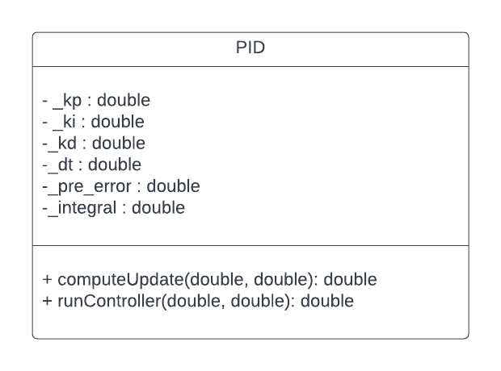
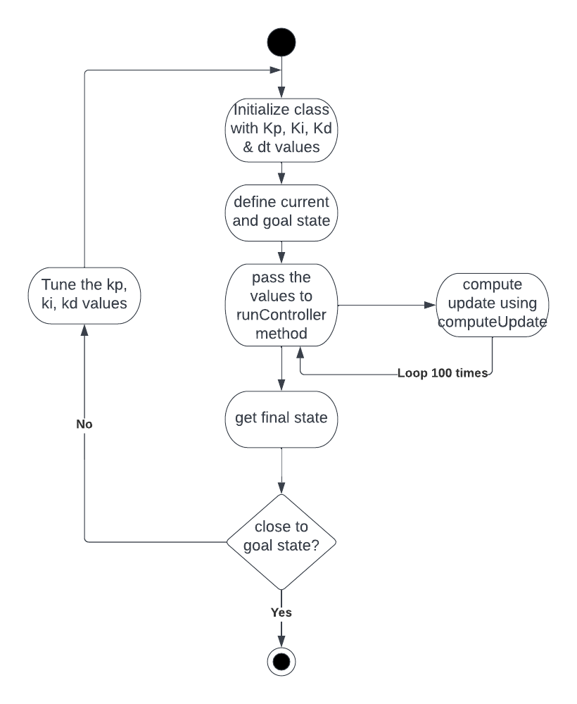

# Week 5: Test-Driven Development Assignment - ENPM 808X

## Overview

This repository pertains to the test driven development exercise. The group members of which are :

- Madhu Narra Chittibabu
- Bhargav Soothram Kumar
- Sahruday Patti
- Divyansh Agarwal

## Part 1 
The members of the pair for Part 1 of this repository are :
 - Madhu Narra Chittibabu (Driver)
 - Bhargav Soothram Kumar (Navigator)

 ## Part 2 
The members of the pair for Part 2 of this repository are :
 - Sahruday Patti (Choose)
 - Divyansh Agarwal (Choose)
 
## Description
The design contains one class, PID. The main function takes the current and goal state as input as to pid class which should be initialized with kp, ki, kd and dt values. The goal and current state is then passed to runController method which calls computUpdate method 100 times to compute final state. 


The UML class diagram is as follows : 



Fig 1 :  UML class diagram  



Fig 2 :  Activity diagram

### Steps to build 
```
    cd ...<path_to_directory>/
    mkdir build
    cd build
    cmake ..
    make
```    
### Steps to run
```
    ./app/shell-app
```
### Steps to unit tests
```
    ./test/cpp-test 
```
### Steps to code coverage
```
    sudo apt-get install lcov
    cmake -D COVERAGE=ON -D CMAKE_BUILD_TYPE=Debug ../
    make
    make code_coverage
```
